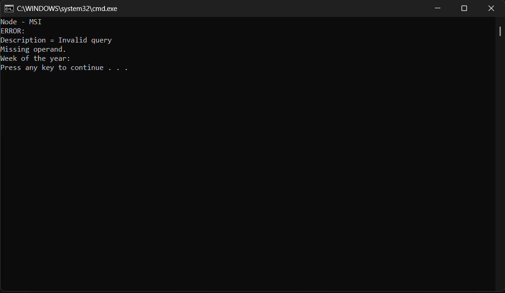
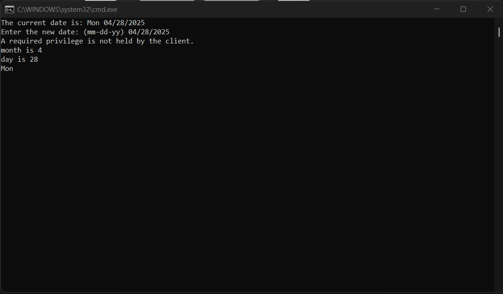

# Operating System Course - Day 02 (03.21.2025)

[](https://learn.microsoft.com/en-us/windows-server/administration/windows-commands/windows-commands)
[](https://www.microsoft.com/windows)
[]()
[]()

> 📚 A comprehensive collection of daily practical lessons for Operating System course focusing on Windows batch scripting.

## 📋 Course Overview

This repository contains practical exercises and implementations for the Operating System course. Each lesson is organized with batch scripts and their corresponding outputs.

## 🗓️ Day 02 Content (03.21.2025)

### 🎯 Learning Materials

- `Pro1.txt` - Linux command examples and file operations
- `Pro2.bat` - Batch script implementation
- `Pro3.bat` - Date manipulation in batch script
- `Pro4.txt` - Additional practice materials

### 📊 Implementation Structure

| Category | File | Description | Visual Output |
|----------|------|-------------|---------------|
| Linux Commands | `Pro1.txt` | File operations and text processing |  |
| Batch Script | `Pro3.bat` | Date manipulation examples |  |


### 📝 Command Explanations

#### Linux File Operations (Pro1.txt)
```bash
# Create empty file
1. touch abc.txt		# Create new empty file
2. vi abc.txt			# Open file in Vim editor
3. more abc.txt		# View file contents page-by-page
4. less abc.txt		# Interactive file viewing
5. ls-ltr			# List files (needs space after ls)
6. find *.txt		# Find all text files

# CSV processing
7. touch xyz.csv		# Create CSV file
8. head -3 xyz.csv		# Show first 3 lines
9. tail -2 xyz.csv		# Show last 2 lines
10. cut -f 1,3 xyz.csv	# Extract columns 1 & 3 (tab)
11. cut -d ',' -f 1,3	# Extract columns 1 & 3 (CSV)
12. > xyz1.csv			# Redirect output to new file
13. awk -F '{print NF;...'	# Count fields in first line
```

#### Batch Scripting (Pro2.bat)
```batch
1. @echo off					# Hide command output
2. wmic path win32_LocalTime...	# Get day of year from WMI
3. set /a week=%dayofyear%/7	# Calculate week number
4. echo Week: %week%			# Display result
```

#### Date Handling (Pro3.bat)
```batch
1. date						# Display system date
2. %date:~ 4,2%				# Extract month (MM format)
3. %date:~ 7,2%				# Extract day (DD format)
4. %date:~ 0,3%				# Extract weekday abbreviation
```

#### Advanced Text Processing (Pro4.txt)
```bash
1. awk -F "," '{print $1}'	# Extract first CSV column
2. sed 's/85/72/g'			# Replace values in stream
3. head -n3 | tail -n1		# Extract 3rd line
4. wc -l					# Count total lines
5. grep '88'				# Filter lines containing 88
```

### 🔍 Technical Notes

- All implementations are in Windows Batch Script
- Each script includes comprehensive command demonstrations
- Visual outputs are captured for reference
- Consistent script formatting and naming conventions

---

<div align="center">

📖 **Learning Path** | 🛠️ **Practical Examples** | 📊 **Visual Outputs**

</div>
